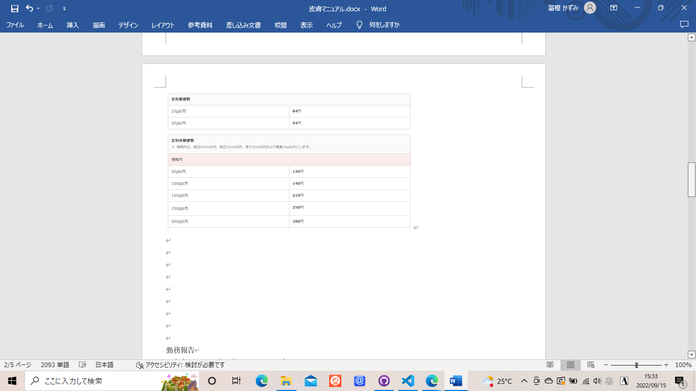

# 事務関連マニュアル
## 休日出勤について
## 経費の精算について

主な摘要項目は次のとおりです。
- 資料代
- 通信費
- 消耗品費

|摘要  |内容
|--|--
-|資料代　|資料本 有料アプリ
+|資料代　|書籍 有料アプリ
|通信費　|切手 宅配便料金
|消耗品　|文具 台所用品

## 宅配便の発送について
## 電話、来客対応について
## ゴミ収集について
## プリンタについて
## 大容量データの送受信について

